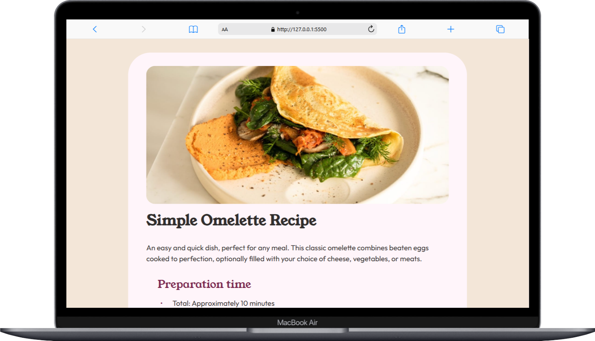
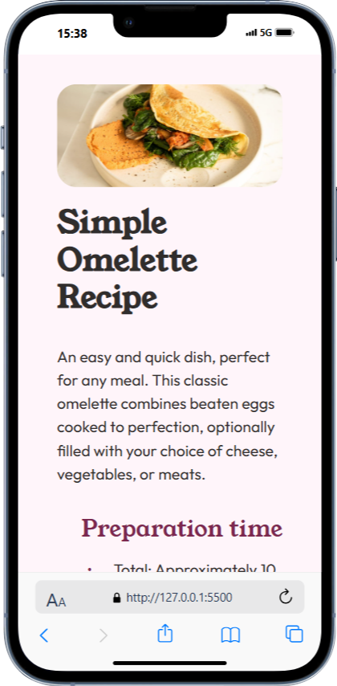

# Frontend Mentor - Recipe Page Solution

This is my solution to the [Recipe Page](https://www.frontendmentor.io/challenges/recipe-page-KiTsR8QQKm) challenge on Frontend Mentor.
This challenge helped me improve my web development skills by working on a concrete and realistic project.

## 📌 Table of Contents

- [Overview](#overview)
  - [Screenshot](#screenshot)
  - [Links](#links)
- [My Process](#my-process)
  - [Built With](#built-with)
  - [What I Learned](#what-i-learned)
  - [Future Development](#future-development)
  - [Useful Resources](#useful-resources)
- [Author](#author)
- [Acknowledgments](#acknowledgments)

## Overview

### Screenshot

**Desktop Version:**


**Mobile Version:**


### Links

- **GitHub Repository:** [GitHub Repo](https://github.com/Samir-guemmaz/FrontEnd-Recipe-Page-Main)
- **Live Version:** _Not deployed yet_

## My Process

### Built With

- **Semantic HTML5**
- **CSS Custom Properties**
- **Flexbox**
- **Mobile-First Approach**

### What I Learned

During this project, I reviewed the basics of **CSS layout techniques** and strengthened my understanding of **semantic HTML5**.
I also improved my knowledge of **pseudo-elements** and **CSS counters** (`counter-reset` and `counter-increment`).

#### 🖥️ Example of semantic HTML used

```html
<section>
    <article class="recipe-information">
        <h2>Preparation Time</h2>
        <ul>
            <li>Total: approximately 10 minutes</li>
            <li>Preparation: 5 minutes</li>
            <li>Cooking: 5 minutes</li>
        </ul>
    </article>
</section>
```

**🎨 Example of custom list styling with CSS:**

```css
ul li::before {
    content: "\002022";
    display: inline-block;
    width: 1.5em;
    margin-left: -1.5em;
}

.recipe-instruction ol {
    list-style: none;
    counter-reset: li;
}

.recipe-instruction ol li {
    counter-increment: li;
}

.recipe-instruction ol li::before {
    content: counter(li) ".";
    color: var(--marron800);
    display: inline-block;
    width: 1.5em;
    margin-left: -1.5em;
    font-weight: 800;
}
```

### Future Development

In future projects, I’d like to:

- 🔍 Improve accessibility by incorporating ARIA roles, using ```<label>``` elements for forms, and optimizing color contrast.
- 🎨 Explore CSS animations to create more dynamic interactions.
- ⚡ Optimize images and assets to enhance performance and loading speed.

### Useful Resources

- 📖 MDN Web Docs - A must-have reference for HTML, CSS, and JavaScript.
- 🎨 CSS Tricks - A fantastic website with CSS tips and guides.

## Author

- **GitHub :** [Samir Guemmaz](https://github.com/Samir-guemmaz)
- **Frontend Mentor :** [@Samir-guemmaz](https://www.frontendmentor.io/profile/Samir-guemmaz)

## Acknowledgments

A big thanks to **Frontend Mentor** for offering these challenges that help improve web development skills.
Special mention to **CSS Tricks** and **MDN Web Docs** for their excellent resources.
